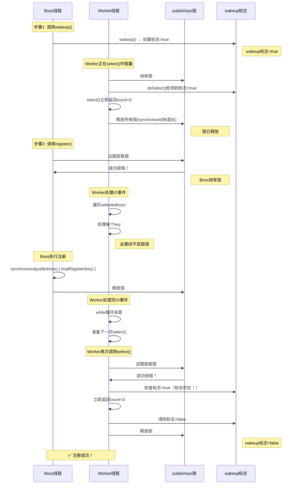
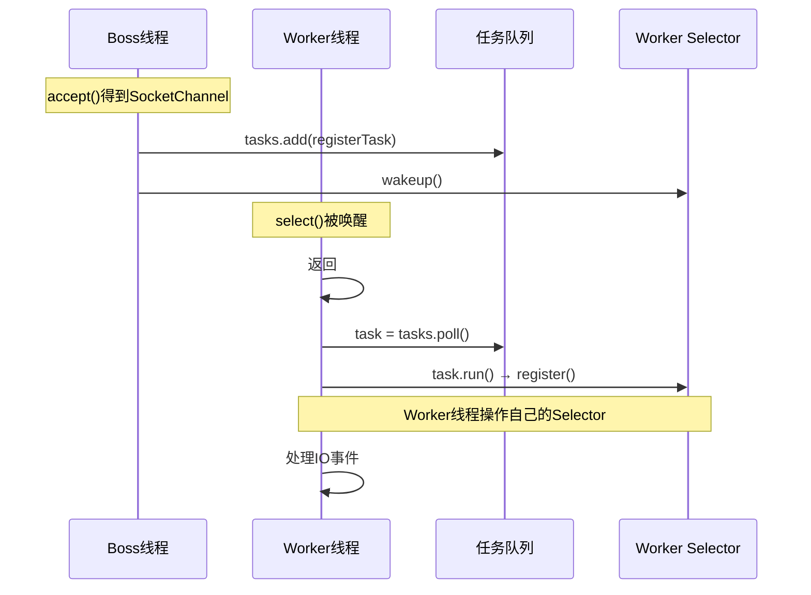

# NIO多线程Reactor模式：直接注册 vs 任务队列

## 问题背景

在实现多线程NIO服务器时（Boss处理连接，Worker处理IO），有两种跨线程注册方式：

### 场景

```
Boss线程：accept()得到SocketChannel
          ↓
      需要注册到Worker线程的Selector
```

**两种实现**：
- 方式1：直接wakeup + 注册（Boss线程直接操作Worker的Selector）
- 方式2：任务队列（Boss线程提交任务，Worker线程在Event Loop中注册）

---

## 📊 两种模式对比

### 方式1：直接wakeup + 注册

```java
// Boss线程
if (selectionKey.isAcceptable()) {
    SocketChannel channel = ssc.accept();
    channel.configureBlocking(false);

    Selector workerSelector = worker.getSelector();
    workerSelector.wakeup();           // ← 唤醒Worker
    channel.register(workerSelector, SelectionKey.OP_READ);  // ← Boss直接注册
}

// Worker线程
while (true) {
    selector.select();  // 被wakeup唤醒
    // 处理IO事件...
}
```

**特点**：
- Boss线程直接操作Worker的Selector
- 跨线程执行注册操作
- 简单直接

### 方式2：任务队列

```java
// Boss线程
if (selectionKey.isAcceptable()) {
    SocketChannel channel = ssc.accept();
    channel.configureBlocking(false);
    worker.register(channel);  // ← 只提交任务
}

// Worker.register()
public void register(SocketChannel sc) {
    tasks.add(() -> {  // ← 任务放入队列
        sc.register(worker, SelectionKey.OP_READ);
        worker.selectNow();
    });
    worker.wakeup();  // ← 唤醒Worker
}

// Worker线程
while (true) {
    worker.select();  // 被wakeup唤醒
    Runnable task = tasks.poll();  // ← 取出任务
    if (task != null) {
        task.run();  // ← 在Worker线程中执行注册
    }
    // 处理IO事件...
}
```

**特点**：
- Boss线程只提交任务
- Worker线程在Event Loop中执行注册
- 所有Selector操作都在Worker线程内部

---

## 🔍 关键区别

### 区别1：注册执行的线程

| 方式 | 注册操作执行线程 | Selector操作位置 |
|------|----------------|-----------------|
| 直接wakeup | Boss线程 | Boss线程跨线程操作Worker的Selector |
| 任务队列 | Worker线程 | Worker线程在Event Loop内部操作 |

### 区别2：时序图

#### 方式1：直接wakeup



**为什么是安全的？**

1. ✅ **Worker.select()返回后不会立即再次获取锁**
   - select()返回后需要处理IO事件
   - 这段时间Boss可以获取锁

2. ✅ **即使Worker抢到锁，也不会阻塞**
   - Worker调用select()检测到wakeup标志
   - 立即返回，释放锁
   - Boss接着可以获取锁

3. ✅ **wakeup标志持久化**
   - 标志会一直存在，直到被select()**消费**
   - 多次select()调用都能检测到

4. ✅ **synchronized保证公平性**
   - 锁释放后，Boss和Worker公平竞争
   - Boss有机会获取锁执行register()

#### 方式2：任务队列



**优势**：所有Selector操作都在Worker线程内部

---

## ✅ 两种方式都可用：关键机制解释

### 机制1：线程安全

**直接wakeup是安全的，因为**：

- wakeup()设置持久化标志
- Worker.select()返回后释放锁
- Boss可以获取锁执行register()
- Worker即使再次调用select()也能检测到标志并立即返回

**任务队列更规范**：
- 所有Selector操作在Worker线程内部
- 符合Event Loop单线程设计理念

### 机制2：统一Event Loop（Netty设计）

```java
// Event Loop标准模式
while (true) {
    selector.select();  // 阻塞等待IO

    // 1. 处理所有任务（注册、关闭、自定义操作）
    processTasks();

    // 2. 处理所有IO事件
    processIOEvents();
}
```

**优势**：
- ✅ 所有操作按顺序执行
- ✅ 单线程处理，无锁竞争
- ✅ 符合Reactor模式

### 机制3：可扩展性（任务队列的优势）

任务队列可以处理多种任务：

```java
private final Queue<Runnable> tasks = new ConcurrentLinkedQueue<>();

// 可以提交各种任务
tasks.add(() -> channel.register(selector, ops));
tasks.add(() -> channel.close());
tasks.add(() -> customOperation());
tasks.add(() -> scheduleTask());

worker.wakeup();  // 一次性唤醒处理所有任务
```

**对比**：
- 直接wakeup：只能解决注册问题，扩展性差
- 任务队列：支持多种任务类型，可扩展性强

---

## 🎯 Netty为何选择任务队列

### 设计理念

```
Event Loop线程完全自主管理自己的Selector：
  - 不接受其他线程直接操作
  - 所有操作通过任务队列提交
  - 在Event Loop内部顺序执行
```

### 代码示例

```java
// Boss线程：只提交任务
worker.register(channel);  // 内部：tasks.add() + wakeup()

// Worker线程：Event Loop
public void run() {
    while (true) {
        try {
            selector.select();

            // 1. 处理所有任务
            Runnable task;
            while ((task = tasks.poll()) != null) {
                task.run();
            }

            // 2. 处理IO事件
            Set<SelectionKey> keys = selector.selectedKeys();
            Iterator<SelectionKey> iter = keys.iterator();
            while (iter.hasNext()) {
                SelectionKey key = iter.next();
                // 处理读/写事件...
            }
        } catch (IOException e) {
            e.printStackTrace();
        }
    }
}
```

---

## 📝 完整对比总结

| 对比项 | 直接wakeup | 任务队列（Netty） |
|--------|-----------|-------------------|
| **注册线程** | Boss线程 | Worker线程 |
| **Selector操作位置** | 跨线程操作 | Event Loop内部 |
| **线程安全** | ✅ 安全（依赖wakeup机制） | ✅ 安全（单线程Event Loop） |
| **并发问题** | ✅ 无（wakeup标志持久化） | ✅ 无（单线程） |
| **可扩展性** | 较差 | 好（支持多种任务） |
| **复杂度** | 简单 | 稍复杂 |
| **符合规范** | 否 | 是（Reactor模式） |
| **生产环境** | 可用 | 推荐（Netty实践） |

---

## 核心要点

1. **直接wakeup方式**：
   - ✅ 是线程安全的（基于wakeup机制和synchronized锁）
   - ✅ wakeup标志持久化，不会失效
   - ✅ Worker处理IO事件期间给Boss获取锁的机会
   - ⚠️ Boss线程跨线程操作Worker的Selector（不符合**Event Loop**理念）

2. **任务队列方式**：
   - ✅ 所有Selector操作都在Worker线程内部
   - ✅ 完全符合Reactor模式和Event Loop设计
   - ✅ 可扩展性强（支持多种任务类型）
   - ✅ Netty等生产框架的选择

3. **两种方式都可用**：
   - 学习项目：直接wakeup（简单易懂）
   - 生产环境：任务队列（更规范、可维护）

4. **关键机制**：
   - wakeup()会设置持久化标志，直到被select()消费
   - Worker的select()返回后有大量"无锁时间"处理IO事件
   - synchronized保证公平竞争，Boss有机会获取锁执行register()
