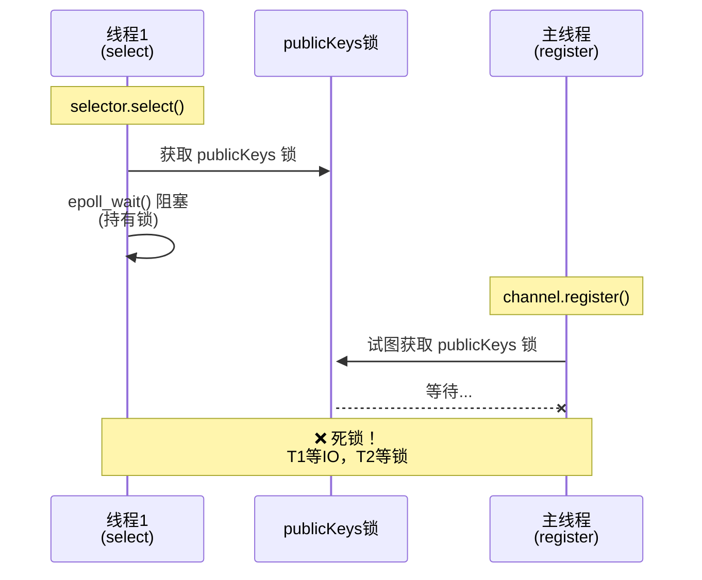
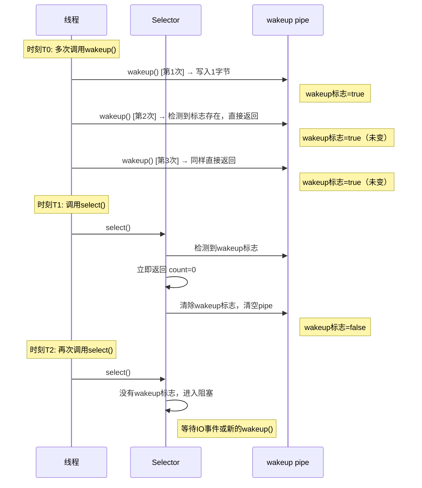

# Selector跨线程死锁问题与正确解决方案

## 核心问题

跨线程调用 `channel.register()` 时，如果目标 Selector 正在另一个线程的 `select()` 调用中阻塞，会导致**死锁**。

---

## 🔥 死锁现象

### 问题代码

```java
// 线程1
Thread t1 = new Thread(() -> {
    selector.select();  // 阻塞
});

// 主线程
ssc.register(selector, SelectionKey.OP_ACCEPT);  // ← 永久阻塞！
```

### 日志表现

```log
22:41:56 [DEBUG] [SelectThread] 线程1: 开始 select() 阻塞...
22:41:58 [DEBUG] [main] 主线程: 准备注册 ServerSocketChannel...
# ← 程序永久卡住
```

---

## 🔍 死锁原因（基于JDK 1.8源码）

### 源码分析

**SelectorImpl.lockAndDoSelect()**：
```java
private int lockAndDoSelect(long timeout) throws IOException {
    synchronized (this) {  // Selector锁
        synchronized (publicKeys) {  // ← publicKeys锁
            synchronized (publicSelectedKeys) {
                return doSelect(timeout);  // epoll_wait()阻塞
            }
        }
    }
}
```

**SelectorImpl.register()**：
```java
protected final SelectionKey register(AbstractSelectableChannel ch, int ops, Object attachment) {
    SelectionKeyImpl k = new SelectionKeyImpl((SelChImpl)ch, this);
    k.attach(attachment);
    synchronized (publicKeys) {  // ← 需要publicKeys锁！
        implRegister(k);
    }
    return k;
}
```

### 死锁形成时序图



**死锁原因**：
- `select()` 持有 `publicKeys` 锁并在 `epoll_wait()` 阻塞
- `register()` 需要获取同一个 `publicKeys` 锁
- 锁竞争导致死锁

---

## ✅ 解决方案

### 方案1：手动调用 wakeup()

```java
// 主线程：注册前先wakeup
selector.wakeup();  // ← 关键！
ssc.register(selector, SelectionKey.OP_ACCEPT);
```

**原理**：
```java
selector.wakeup()
  → 向wakeup pipe写入数据
  → epoll_wait()检测到pipe可读
  → select()返回，释放publicKeys锁
  → register()可以获取锁，完成注册
```

**核心理解**：
- ⚠️ `select()` 阻塞时持有 `publicKeys` 锁
- ⚠️ `register()` 需要获取同一个 `publicKeys` 锁
- ✅ `wakeup()` 的唯一作用：**打破 `select()` 的阻塞**，让它返回并释放锁
- ✅ `select()` 返回后，`register()` 才能成功获取锁并完成注册

**简单总结**：
```
select()阻塞（持有锁）→ wakeup()打破阻塞 → select()返回（释放锁）→ register()获取锁并注册
```

### 方案2：使用 selectNow()

```java
// Event Loop
while (running) {
    int count = selector.selectNow();  // 不阻塞
    if (count == 0) {
        Thread.sleep(1);
        continue;
    }
    // 处理事件...
}

// 主线程：可以安全注册
ssc.register(selector, ops);
```

### 方案3：单线程Event Loop（推荐）

```java
public static void main(String[] args) {
    Selector selector = Selector.open();
    ServerSocketChannel ssc = ServerSocketChannel.open();
    ssc.configureBlocking(false);
    ssc.bind(new InetSocketAddress(7070));

    // 主线程注册
    ssc.register(selector, SelectionKey.OP_ACCEPT);

    // 主线程Event Loop
    while (true) {
        selector.select();
        // 处理事件...
    }
}
```

---

## 📝 完整示例代码

### SelectorMultiThreadDemo.java（修复后）

```java
package cn.clazs.jdk.jnio.multithread;

import lombok.extern.slf4j.Slf4j;

import java.io.IOException;
import java.net.InetSocketAddress;
import java.nio.channels.SelectionKey;
import java.nio.channels.Selector;
import java.nio.channels.ServerSocketChannel;
import java.util.concurrent.TimeUnit;

@Slf4j
public class SelectorMultiThreadDemo {
    public static void main(String[] args) throws IOException, InterruptedException {
        final Selector selector = Selector.open();

        // 线程1：select()阻塞
        Thread selectThread = new Thread(() -> {
            try {
                log.debug("线程1: 开始 select() 阻塞...");
                int count = selector.select();
                log.debug("线程1: select() 返回！count={}", count);
            } catch (IOException e) {
                e.printStackTrace();
            }
        }, "SelectThread");

        selectThread.start();
        TimeUnit.SECONDS.sleep(2);

        // 主线程：注册channel
        log.debug("主线程: 准备注册 ServerSocketChannel...");

        // ⚠️ 关键：必须先wakeup()
        selector.wakeup();
        log.debug("主线程: 已调用 wakeup()");

        ServerSocketChannel ssc = ServerSocketChannel.open();
        ssc.configureBlocking(false);
        ssc.bind(new InetSocketAddress(7070));

        SelectionKey key = ssc.register(selector, SelectionKey.OP_ACCEPT);
        log.debug("主线程: 注册完成！key={}", key);

        selectThread.join();
        log.debug("主线程: 线程1已结束");

        selector.close();
    }
}
```

### 预期运行结果

```log
22:41:56 [DEBUG] [SelectThread] 线程1: 开始 select() 阻塞...
22:41:58 [DEBUG] [main] 主线程: 准备注册 ServerSocketChannel...
22:41:58 [DEBUG] [main] 主线程: 已调用 wakeup()
22:41:58 [DEBUG] [SelectThread] 线程1: select() 返回！count=0
22:41:58 [DEBUG] [main] 主线程: 注册完成！key=...
22:41:58 [DEBUG] [main] 主线程: 线程1已结束
```

---

## 📚 核心知识点

### 1. 死锁的根本原因

```
线程1: selector.select() 持有 publicKeys锁，阻塞在epoll_wait()
+
线程2: channel.register() 等待 publicKeys锁
↓
死锁！
```

### 2. wakeup() 的作用

```java
selector.wakeup();
// 1. 向wakeup pipe写入数据
// 2. epoll_wait()检测到pipe可读，立即返回
// 3. select()返回，释放publicKeys锁
// 4. register()可以获取锁
```

### 3. 跨线程操作规则

| 操作 | 是否需要wakeup? |
|------|----------------|
| 同一线程 | ❌ 不需要 |
| 不同线程（select阻塞中） | ✅ **必须** |
| 不同线程（select未阻塞） | ❌ 不需要 |

### 4. wakeup() 的特点：幂等性

**什么是幂等性？**
- 多次调用 `wakeup()` 只产生一次效果
- 类比：按门铃（按多次=响一次）

**代码示例**：
```java
selector.wakeup();  // 第1次：设置wakeup标志 → 有效
selector.wakeup();  // 第2次：wakeup标志已存在 → 无效
selector.wakeup();  // 第3次：仍然无效

selector.select();  // 立即返回，清除wakeup标志
selector.select();  // 没有wakeup标志，再次阻塞
```

**wakeup() 与 select() 交互时序图**：



**关键要点**：
- ✅ 多次 `wakeup()` 只生效一次（避免重复唤醒）
- ✅ `select()` 返回后清除wakeup标志
- ✅ 清除后新的 `wakeup()` 可以再次生效
- ✅ 设计目的：**打破 `select()` 阻塞，释放锁，让 `register()` 能执行**


---

## ⚠️ 常见错误

### 错误1：忘记调用wakeup()

```java
// ❌ 死锁！
Thread t1 = new Thread(() -> selector.select());
t1.start();
ssc.register(selector, ops);
```

### 错误2：时机错误

```java
// ❌ 太早了
Thread t1 = new Thread(() -> {
    Thread.sleep(2000);
    selector.select();
});
t1.start();
selector.wakeup();  // select()还没调用
ssc.register(selector, ops);  // 仍然死锁
```

### 错误3：错误认知

```java
// ❌ 错误观点：register()会自动wakeup
// ✅ 实际情况：完全不会！必须手动调用
```

---

## 🎯 最佳实践

### 推荐1：单线程Event Loop

```java
// 最简单、最高效
Selector selector = Selector.open();
ssc.register(selector, ops);

while (true) {
    selector.select();
    // 处理事件
}
```

### 推荐2：多线程时先wakeup()

```java
// 如果必须跨线程注册
selector.wakeup();  // ← 先唤醒
ssc.register(selector, ops);  // ← 再注册
```

### 推荐3：使用任务队列（Netty做法）

```java
private final Queue<Runnable> registerTasks = new ConcurrentLinkedQueue<>();

// Event Loop
while (running) {
    selector.select();

    // 处理注册任务
    Runnable task;
    while ((task = registerTasks.poll()) != null) {
        task.run();
    }

    // 处理IO事件
}

// 其他线程
registerTasks.offer(() -> sc.register(selector, ops));
selector.wakeup();
```

---

## 总结

1. **死锁原因**：`select()` 持有 `publicKeys` 锁阻塞，`register()` 等待同一把锁
2. **解决方案**：在 `register()` 之前手动调用 `selector.wakeup()`
3. **最佳实践**：单线程Event Loop，避免跨线程操作
4. **关键事实**：`register()` **不会**自动 `wakeup()`，必须手动调用

**核心要点**：
- 跨线程注册前，必须先 `wakeup()`
- 单线程Event Loop是最简单、最高效的模式
- 不要依赖任何"自动wakeup"机制
