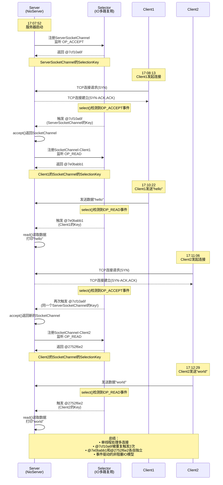

## 程序演示

1. 演示顺序：首先启动服务器
2. 在Client1和Client2的write方法的调用处打断点
3. 对Client1进行debug模式启动，停在write后放行端点
4. 对Client2做同样操作

另注：下文中用字符表示的图形化输出结果，是工具类的工具方法`ByteBufferUtil.debugRead`，用于打印可读取内容

本次提交的`NioServer.java`

```java
@Slf4j
public class NioServer {
    public static void main(String[] args) {
        // 1.创建ServerSocketChannel并绑定端口（相当于传统ServerSocket）
        // ServerSocketChannel：用于监听和接受客户端连接请求；
        try (ServerSocketChannel ssc = ServerSocketChannel.open()) {
            ssc.bind(new InetSocketAddress(7070));
            log.debug("服务器启动 ServerSocketChannel: {}", ssc);

            // 2. 创建Selector选择器（IO多路复用的核心）
            // Selector会利用操作系统的底层机制（如Linux的epoll）来监听多个Channel的事件
            Selector selector = Selector.open();

            // 3. 设置Channel为非阻塞模式，只有非阻塞模式的Channel才能注册到Selector
            // configureBlocking(false)会调用底层系统API设置socket为O_NONBLOCK模式
            ssc.configureBlocking(false);

            // 4. 将ServerSocketChannel注册到Selector，关注OP_ACCEPT事件：即接收客户端连接的事件
            // 返回的SelectionKey包含了Channel和Selector的关联关系
            SelectionKey sscKey = ssc.register(selector, SelectionKey.OP_ACCEPT);

            // 5. 事件循环（Event Loop）- NIO的核心模式
            while (true) {
                // 6. 阻塞等待事件发生（如果没有事件，线程会阻塞在这里）
                // selector.select()会调用操作系统的select/epoll_wait系统调用
                // 当有就绪的Channel时返回，返回值是就绪Channel的数量
                int count = selector.select();
                // selector.selectNow() 是非阻塞版本，立即返回当前就绪的Channel数量

                log.debug("select count: {}", count);

                // 7. 获取所有就绪的SelectionKey（这是依赖于S/SocketChannel对于指定Selector的注册！）
                Set<SelectionKey> keys = selector.selectedKeys();

                // 8. 遍历处理所有就绪事件
                Iterator<SelectionKey> iter = keys.iterator();
                while (iter.hasNext()) {
                    SelectionKey key = iter.next();
                    log.debug("当前遍历 key: {}", key);

                    // 9. 判断事件类型并处理
                    if (key.isAcceptable()) {
                        // OP_ACCEPT事件：有新的客户端连接请求
                        ServerSocketChannel channel = (ServerSocketChannel) key.channel();
                        // 接受客户端连接（非阻塞模式下，如果没有连接会返回null）
                        SocketChannel sc = channel.accept();
                        log.debug("连接建立: {}", sc);
                        // 这里将SocketChannel也设置为非阻塞，并注册到Selector关注OP_READ事件，以读取客户端数据
                        sc.configureBlocking(false);
                        sc.register(selector, SelectionKey.OP_READ);
                    } else if (key.isReadable()) {
                        SocketChannel channel = (SocketChannel) key.channel();
                        ByteBuffer bf = ByteBuffer.allocate(16);
                        channel.read(bf);
                        bf.flip();
                        debugRead(bf);
                    } else if (key.isWritable()) {

                    }
                    // 处理完毕后必须手动移除该SelectionKey
                    iter.remove();
                }
            }
        } catch (IOException e) {
            e.printStackTrace();
        }
    }
}
```

两个Client：

```java
@Slf4j
public class Client1 {
    public static void main(String[] args) {
        // 通过指定ip、端口建立连接
        try (Socket socket = new Socket("localhost", 7070)) {
            log.debug("{}", socket);

            // 尝试发送数据
            socket.getOutputStream().write("hello".getBytes()); // 断点处

            // 模拟一个阻塞，来维持连接不关闭
            System.in.read();
        } catch (IOException e) {
            e.printStackTrace();
        }
    }
}


public class Client2 {
    public static void main(String[] args) throws IOException {
        SocketChannel sc = SocketChannel.open();
        sc.connect(new InetSocketAddress("localhost", 7070));

        sc.write(Charset.defaultCharset().encode("world")); // 断点处

        // 模拟阻塞等待
        System.in.read();
    }
}
```

观察现象如下日志记录所示！

```text
17:07:52 [DEBUG] [main] c.c.j.j.NioServer - 服务器启动 ServerSocketChannel: sun.nio.ch.ServerSocketChannelImpl[/0:0:0:0:0:0:0:0:7070]
17:08:13 [DEBUG] [main] c.c.j.j.NioServer - select count: 1
17:08:13 [DEBUG] [main] c.c.j.j.NioServer - 当前遍历 key: sun.nio.ch.SelectionKeyImpl@7cf10a6f
17:08:13 [DEBUG] [main] c.c.j.j.NioServer - 连接建立: java.nio.channels.SocketChannel[connected local=/127.0.0.1:7070 remote=/127.0.0.1:5367]
17:10:22 [DEBUG] [main] c.c.j.j.NioServer - select count: 1
17:10:22 [DEBUG] [main] c.c.j.j.NioServer - 当前遍历 key: sun.nio.ch.SelectionKeyImpl@7e0babb1
+--------+-------------------- read -----------------------+----------------+
position: [0], limit: [5]
         +-------------------------------------------------+
         |  0  1  2  3  4  5  6  7  8  9  a  b  c  d  e  f |
+--------+-------------------------------------------------+----------------+
|00000000| 68 65 6c 6c 6f                                  |hello           |
+--------+-------------------------------------------------+----------------+
17:11:06 [DEBUG] [main] c.c.j.j.NioServer - select count: 1
17:11:06 [DEBUG] [main] c.c.j.j.NioServer - 当前遍历 key: sun.nio.ch.SelectionKeyImpl@7cf10a6f
17:11:06 [DEBUG] [main] c.c.j.j.NioServer - 连接建立: java.nio.channels.SocketChannel[connected local=/127.0.0.1:7070 remote=/127.0.0.1:5601]
17:12:29 [DEBUG] [main] c.c.j.j.NioServer - select count: 1
17:12:29 [DEBUG] [main] c.c.j.j.NioServer - 当前遍历 key: sun.nio.ch.SelectionKeyImpl@2752f6e2
+--------+-------------------- read -----------------------+----------------+
position: [0], limit: [5]
         +-------------------------------------------------+
         |  0  1  2  3  4  5  6  7  8  9  a  b  c  d  e  f |
+--------+-------------------------------------------------+----------------+
|00000000| 77 6f 72 6c 64                                  |world           |
+--------+-------------------------------------------------+----------------+
```

## 观察结果分析和理解

### 核心要点如下

#### 1. SelectionKey的本质与分类

**`sun.nio.ch.SelectionKeyImpl@7cf10a6f` - 这是 ServerSocketChannel 的 SelectionKey**
- 这不是 `ServerSocketChannel` 本身，而是 `ServerSocketChannel` 在 `Selector` 上的**注册令牌**
- 作用：监听 **OP_ACCEPT** 事件（客户端连接请求）
- 特点：同一个 ServerSocketChannel 只会生成 **一个** SelectionKey
- 证据：Client1（17:08:13）和 Client2（17:11:06）连接时，都出现了 `@7cf10a6f`，证明它复用了同一个 SelectionKey
- 对应代码：`NioServer.java:61` - `ssc.register(selector, SelectionKey.OP_ACCEPT)`

**`sun.nio.ch.SelectionKeyImpl@7e0babb1` 和 `@2752f6e2` - 这是 SocketChannel 的 SelectionKey**
- 这是每个客户端连接成功后，`ServerSocketChannel.accept()` 返回的 `SocketChannel` 在 `Selector` 上的注册令牌
- 作用：监听 **OP_READ** 事件（读取客户端数据）
- 特点：**每个客户端连接都会生成一个独立的** SelectionKey（@7e0babb1 和 @2752f6e2 不同）
- 对应代码：`NioServer.java:92` - `sc.register(selector, SelectionKey.OP_READ)`

#### 2. 完整的事件流转过程

```
时间轴分析：
17:07:52 - 服务器启动，ServerSocketChannel 注册到 Selector（监听 OP_ACCEPT）

17:08:13 - Client1 发起连接
  → Selector 检测到 OP_ACCEPT 事件就绪
  → 触发 @7cf10a6f（ServerSocketChannel的SelectionKey）
  → 执行 accept() 返回 SocketChannel
  → 将该 SocketChannel 注册到 Selector（监听 OP_READ）

17:10:22 - Client1 发送 "hello"
  → Selector 检测到 OP_READ 事件就绪
  → 触发 @7e0babb1（Client1的SocketChannel的SelectionKey）
  → 读取数据并打印

17:11:06 - Client2 发起连接
  → Selector 再次检测到 OP_ACCEPT 事件就绪
  → 再次触发 @7cf10a6f（同一个ServerSocketChannel的SelectionKey！）
  → 执行 accept() 返回新的 SocketChannel
  → 将新 SocketChannel 注册到 Selector（监听 OP_READ）

17:12:29 - Client2 发送 "world"
  → Selector 检测到 OP_READ 事件就绪
  → 触发 @2752f6e2（Client2的SocketChannel的SelectionKey）
  → 读取数据并打印
```

#### 2.1 Mermaid时序图可视化



**时序图说明：**
- **@7cf10a6f**（ServerSocketChannel的SelectionKey）被触发了2次：Client1连接和Client2连接
- **@7e0babb1**（Client1的SelectionKey）：专门监听Client1的OP_READ事件
- **@2752f6e2**（Client2的SelectionKey）：专门监听Client2的OP_READ事件
- **Selector**作为IO多路复用核心，统一管理所有Channel的事件监听

#### 3. 关键技术细节

**SelectionKey vs Channel 的关系：**
- 一个 `Channel` 可以注册到多个 `Selector`（生成多个 SelectionKey）
- 一个 `Selector` 可以管理多个 `Channel`（每个 Channel 一个 SelectionKey）
- `SelectionKey` 就像是："Channel 在 Selector 上的挂号单"

**为什么同一个 ServerSocketChannel 的 SelectionKey 会重复触发？**
- 因为 `SelectionKey` 是**事件令牌**，不是一次性使用的
- 每当有新的客户端连接，`@7cf10a6f` 就会再次出现在 `selectedKeys()` 中
- 这就像"电话总机"每次有新来电时，同一个总机的指示灯会闪烁

**为什么每个客户端的 SelectionKey 都不同？**
- 每个 `accept()` 返回的 `SocketChannel` 都是**新的对象实例**
- 它们在 `Selector` 上注册时，各自生成独立的 `SelectionKey`
- `@7e0babb1` = Client1 的连接，`@2752f6e2` = Client2 的连接

#### 4. 代码与日志的对应关系

| 代码位置 | 日志证据 | 说明 |
|---------|---------|------|
| `NioServer.java:61` | 无 | ServerSocketChannel 注册 OP_ACCEPT |
| `NioServer.java:87` | 17:08:13 / 17:11:06 | accept() 建立两个连接 |
| `NioServer.java:92` | 无 | 将 SocketChannel 注册 OP_READ |
| `NioServer.java:96` | 17:10:22 / 17:12:29 | 读取两个客户端的数据 |

#### 5. 总结

这个实验完美展示了 Java NIO 的核心机制：
- **单线程处理多连接**：一个 Event Loop 处理了 Client1 和 Client2 的所有操作
- **事件驱动模型**：只有在事件就绪时（连接/数据到达）才执行代码
- **多路复用原理**：一个 Selector 同时监听 OP_ACCEPT 和多个 OP_READ 事件
- **SelectionKey 的复用**：ServerSocketChannel 的 SelectionKey 被多次触发，而每个 SocketChannel 有独立的 SelectionKey
