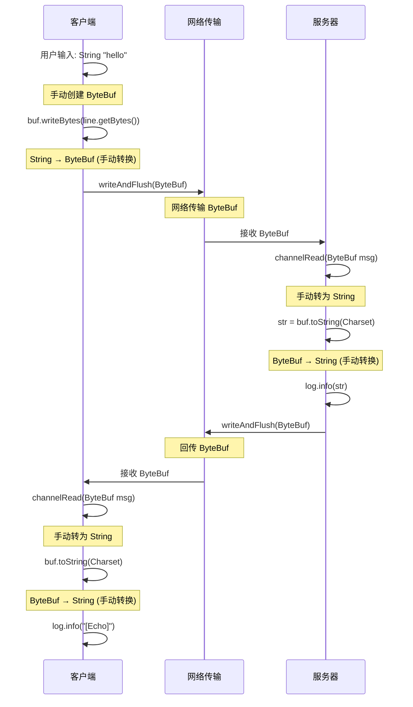
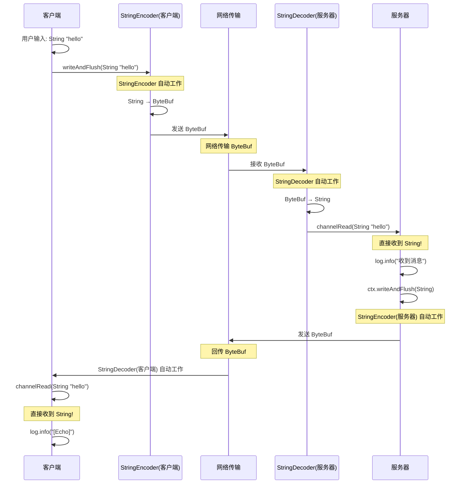
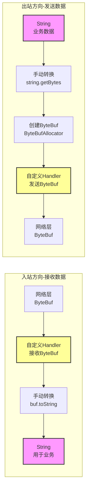
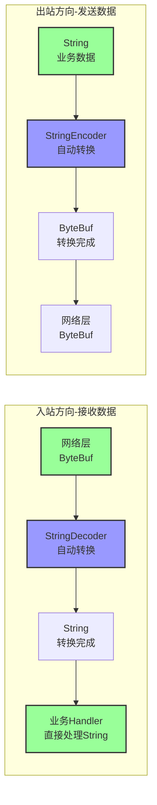
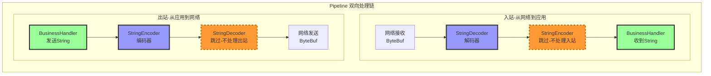
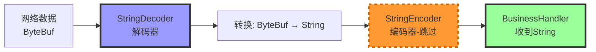
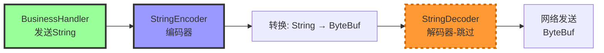

# Netty String 编解码器原理详解

## 一、不使用编解码器的情况（原代码）

### 数据流转关系图



### 详细流程

#### 1. 客户端发送流程
```java
// DemoClient.java:55-57
String line = sc.nextLine();           // 用户输入是 String 类型
ByteBuf buf = ByteBufAllocator.DEFAULT.buffer();  // 手动创建 ByteBuf
buf.writeBytes(line.getBytes());        // 手动将 String 转为 ByteBuf
channel.writeAndFlush(buf);             // 发送 ByteBuf
```

**发送时类型**: `String` → 手动转换 → `ByteBuf` → 网络传输

#### 2. 服务器接收流程
```java
// EchoServer.java:26-31
public void channelRead(ChannelHandlerContext ctx, Object msg) {
    ByteBuf buf = (ByteBuf) msg;        // 接收到的是 ByteBuf 类型
    String str = buf.toString(Charset.defaultCharset()); // 手动转为 String
    log.info("收到客户端消息: {}", str);
    ch.writeAndFlush(buf);              // 直接发回 ByteBuf
}
```

**接收时类型**: 网络接收 → `ByteBuf` → 手动转换 → `String`（仅用于打印）

#### 3. 客户端接收回显流程
```java
// DemoClient.java:26-28
public void channelRead(ChannelHandlerContext ctx, Object msg) {
    ByteBuf buf = (ByteBuf) msg;        // 接收回显的 ByteBuf
    log.info("[Echo]: {}", buf.toString(Charset.defaultCharset())); // 手动转为 String 打印
}
```

### 总结（无编解码器）

| 场景 | 发送方类型 | 接收方类型 | 谁负责转换 | 转换位置 |
|------|-----------|-----------|----------|---------|
| 客户端 → 服务器 | `ByteBuf` | `ByteBuf` | ❌ 无自动转换 | 客户端手动: String → ByteBuf<br/>服务器手动: ByteBuf → String |
| 服务器 → 客户端 | `ByteBuf` | `ByteBuf` | ❌ 无自动转换 | 客户端手动: ByteBuf → String |

**核心特点**:
- ✅ 网络传输层始终是 `ByteBuf`
- ❌ 业务层需要手动处理 `ByteBuf` 和 `String` 的转换
- ❌ 每次收发都要写重复的转换代码
- ❌ 代码繁琐，容易出错

---

## 二、使用 String 编解码器的情况

### Pipeline 中的编解码器位置

```java
// 必须添加在业务 Handler 之前！
ch.pipeline().addLast(new StringDecoder());  // 解码器：入站处理器
ch.pipeline().addLast(new StringEncoder());  // 编码器：出站处理器
ch.pipeline().addLast(new YourBusinessHandler());  // 业务 Handler
```

### 数据流转关系图



### 详细流程

#### 1. 客户端发送流程（使用编码器）
```java
// DemoClient.java:57 (优化后)
String line = sc.nextLine();           // 👈 用户输入是 String 类型
channel.writeAndFlush(line);            // 👈 直接发送 String！

// 💡 底层发生了什么：
// 1. StringEncoder 拦截到出站数据（String 类型）
// 2. StringEncoder 自动调用: byte[] bytes = msg.getBytes(Charset.defaultCharset());
// 3. StringEncoder 创建 ByteBuf 并写入 bytes
// 4. 最终网络传输的仍是 ByteBuf
```

**发送时类型**: `String` → **StringEncoder自动转换** → `ByteBuf` → 网络传输

#### 2. 服务器接收流程（使用解码器）
```java
// EchoServer.java:27-30 (优化后)
public void channelRead(ChannelHandlerContext ctx, Object msg) {
    String str = (String) msg;          // 直接接收到 String 类型！
    log.info("收到客户端消息: {}", str);
    ctx.writeAndFlush(str);             // 直接发送 String！
}
```

> 💡 底层发生了什么：
>
> 1. StringDecoder 拦截到入站数据（ByteBuf 类型）
> 2. StringDecoder 自动调用: String str = buf.toString(Charset.defaultCharset());
> 3. StringDecoder 将转换后的 String 传递给下一个 Handler
> 4. 业务 Handler 收到的就是 String

**接收时类型**: 网络接收 → `ByteBuf` → **StringDecoder自动转换** → `String` → 业务处理

#### 3. 服务器回显流程（使用编码器）
```java
// EchoServer.java:30 (优化后)
ctx.writeAndFlush(str);                 // 直接发送 String
```

> 💡 底层发生了什么：
>
> 1. StringEncoder 拦截到出站数据（String 类型）
> 2. 自动转换为 ByteBuf 后发送给客户端

#### 4. 客户端接收回显流程（使用解码器）

```java
// DemoClient.java:28 (优化后)
public void channelRead(ChannelHandlerContext ctx, Object msg) {
    String str = (String) msg;          // 直接接收到 String！
    log.info("[Echo]: {}", str);
}
```

> 💡 底层发生了什么：
>
> 1. StringDecoder 将服务器的 ByteBuf 转换为 String
> 2. 业务 Handler 直接收到 String

### 总结（使用编解码器）

| 场景 | 发送方类型 | 接收方类型 | 谁负责转换 | 自动转换时机 |
|------|-----------|-----------|----------|------------|
| 客户端 → 服务器 | `String` | `String` | ✅ **StringEncoder**（客户端出站）<br/>✅ **StringDecoder**（服务器入站） | 发送前: String → ByteBuf<br/>接收后: ByteBuf → String |
| 服务器 → 客户端 | `String` | `String` | ✅ **StringEncoder**（服务器出站）<br/>✅ **StringDecoder**（客户端入站） | 发送前: String → ByteBuf<br/>接收后: ByteBuf → String |

**核心特点**:
- ✅ 业务层只处理 `String`，符合业务逻辑
- ✅ 编解码器自动处理 `ByteBuf` 转换
- ✅ 代码简洁，不易出错
- ✅ 网络传输层仍是 `ByteBuf`（对业务透明）

---

## 三、编解码器工作原理对比

### Pipeline 数据流向图（无编解码器）



### Pipeline 数据流向图（有编解码器）



---

## 四、为什么编解码器要放在业务 Handler 之前？

### Pipeline 的责任链模式

```java
ch.pipeline().addLast(new StringDecoder());     // 第 1 站：解码
ch.pipeline().addLast(new StringEncoder());     // 第 2 站：编码
ch.pipeline().addLast(new YourBusinessHandler()); // 第 3 站：业务逻辑
```

### Pipeline 结构图



### 入站数据流（接收数据）



### 出站数据流（发送数据）



**关键点**:
- **解码器**只处理**入站**数据（`extends ByteToMessageDecoder`）
- **编码器**只处理**出站**数据（`extends MessageToByteEncoder<String>`）
- 它们互不干扰，各司其职
- 必须在业务 Handler 之前添加，这样才能先转换，后处理

---

## 五、实际代码对比

### 客户端对比

#### 无编解码器（原）
```java
// DemoClient.java:55-57
String line = sc.nextLine();                    // 获取 String
ByteBuf buf = ByteBufAllocator.DEFAULT.buffer(); // 手动创建 ByteBuf
buf.writeBytes(line.getBytes());                 // 手动转换
channel.writeAndFlush(buf);                      // 发送 ByteBuf

// DemoClient.java:26-28
public void channelRead(ChannelHandlerContext ctx, Object msg) {
    ByteBuf buf = (ByteBuf) msg;                                 // 收到 ByteBuf
    log.info("[Echo]: {}", buf.toString(Charset.defaultCharset())); // 手动转 String
}
```

#### 有编解码器（优化后）
```java
// DemoClient.java:57
String line = sc.nextLine();       // 获取 String
channel.writeAndFlush(line);        // 直接发送 String！✅ 简洁

// DemoClient.java:28
public void channelRead(ChannelHandlerContext ctx, Object msg) {
    String str = (String) msg;      // 直接收到 String！✅ 简洁
    log.info("[Echo]: {}", str);
}
```

### 服务器对比

#### 无编解码器（原）
```java
// EchoServer.java:26-31
public void channelRead(ChannelHandlerContext ctx, Object msg) {
    ByteBuf buf = (ByteBuf) msg;                                // 收到 ByteBuf
    String str = buf.toString(Charset.defaultCharset());        // 手动转 String
    log.info("收到客户端消息: {}", str);
    ch.writeAndFlush(buf);                                      // 发送 ByteBuf
    log.info("[Echo]: {}", str);
}
```

#### 有编解码器（优化后）
```java
// EchoServer.java:27-30
public void channelRead(ChannelHandlerContext ctx, Object msg) {
    String str = (String) msg;      // 直接收到 String！
    log.info("收到客户端消息: {}", str);
    ctx.writeAndFlush(str);         // 直接发送 String！✅ 简洁
    log.info("[Echo]: {}", str);
}
```

---

## 六、常见问题

### Q1: 既然网络传输必须是 ByteBuf，为什么能发送 String？
**A**: 编码器在发送前**自动**将 String 转为 ByteBuf，这个过程**对业务代码<u>透明</u>**。

### Q2: 如果不添加编码器，直接发送 String 会怎样？
**A**: **客户端自爆，服务器无感。**

**原因**: Netty 底层 `filterOutboundMessage()` 会检查消息类型,只接受 `ByteBuf` 或 `FileRegion`。直接发送 `String` 会抛出 `UnsupportedOperationException: unsupported message type: String`,**网络包根本没生成,服务器什么都收不到**。

**验证代码**:
```java
channel.writeAndFlush("hello").addListener(future -> {
    if (!future.isSuccess()) {
        System.out.println("发送失败: " + future.cause().getMessage());
        // 输出: unsupported message type: String (expected: ByteBuf, FileRegion)
    }
});
```

**结论**: Netty 不会自作聪明地转码,要么加 `StringEncoder`,要么手动转 `ByteBuf`。

### Q3: 解码器和编码器是必须成对出现的吗？
**A**: 不一定！
- 如果只接收不发送（如只读服务器），只需 **StringDecoder**
- 如果只发送不接收（如单向发送客户端），只需 **StringEncoder**
- 如果**双向通信**（如 Echo 服务器），**两个都要加**

### Q4: 编解码器的顺序有要求吗？
**A**: 没有严格要求，但建议：

```java
ch.pipeline().addLast(new StringDecoder());  // 先解码
ch.pipeline().addLast(new StringEncoder());  // 后编码
ch.pipeline().addLast(new YourHandler());    // 最后业务逻辑
```
这个顺序更符合直觉（先处理输入，再处理输出，最后业务逻辑）。

### Q5: 字符编码（Charset）怎么指定？
**A**: 默认使用 `Charset.defaultCharset()`（通常是 UTF-8），如需指定：
```java
// 指定 UTF-8 编码
ch.pipeline().addLast(new StringDecoder(CharsetUtil.UTF_8));
ch.pipeline().addLast(new StringEncoder(CharsetUtil.UTF_8));
```

---

## 七、总结

### 核心要点

1. **网络传输层永远是 ByteBuf**，这是 TCP/IP 协议的要求
2. **String 编解码器的作用**：
   - 解码器：接收时 `ByteBuf` → `String`
   - 编码器：发送时 `String` → `ByteBuf`
3. **业务层只需处理 String**，符合业务逻辑，代码更简洁
4. **必须添加在业务 Handler 之前**，确保数据先转换再处理

### 何时使用 String 编解码器？

✅ **推荐使用**:
- 基于文本的协议（HTTP、WebSocket、自定义文本协议）
- 需要频繁处理字符串的业务
- 简化代码，提高可读性

❌ **不推荐使用**:
- 二进制协议（gRPC、Thrift 等）
- 需要直接操作字节的高性能场景
- 传输非文本数据（图片、视频等）

### 扩展阅读

Netty 还提供了其他常用的编解码器：
- `LengthFieldPrepender` / `LengthFieldFrameDecoder` - 处理带长度字段的协议
- `DelimiterBasedFrameDecoder` - 按分隔符拆分数据
- `FixedLengthFrameDecoder` - 固定长度拆分
- `JsonObjectDecoder` - JSON 数据解析

可以根据实际协议选择合适的编解码器组合！

> Author: clazs
>
> Date: 2026-1-21 14:11:44
>
> Update: 2026-1-21 14:11:57

