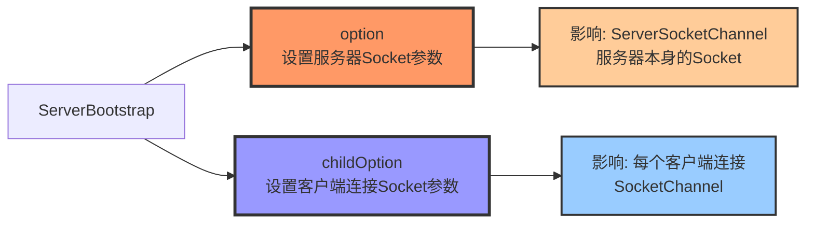
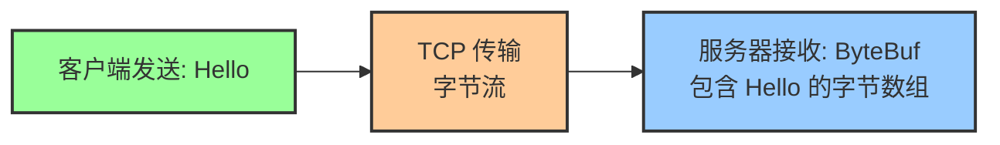
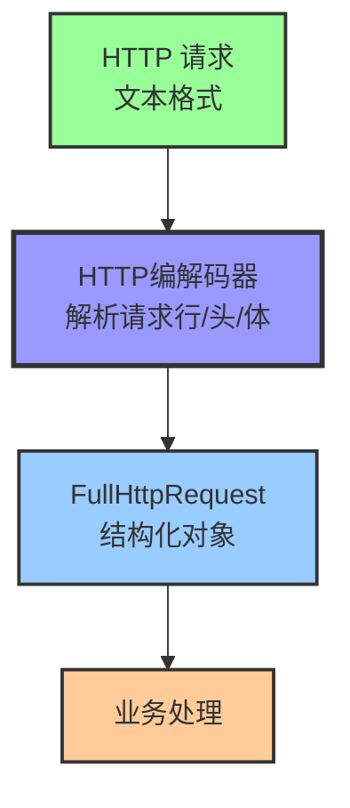
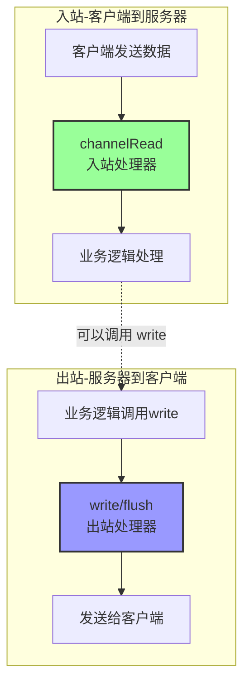
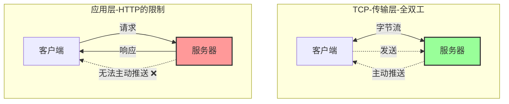
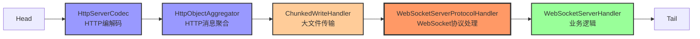
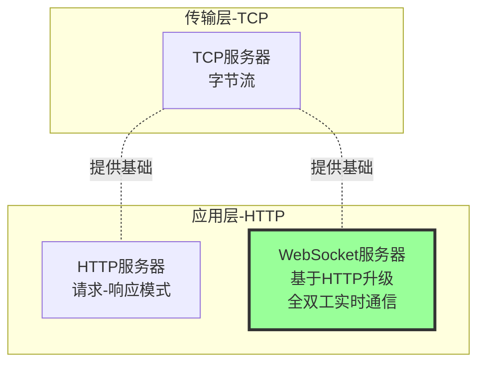

# Netty 服务器实现常见问题解答

> 基于 Netty TCP/HTTP/WebSocket 服务器实现的代码层面深度解析

---

## 📚 目录

- [一、Channel 类型选择：SocketChannel vs NioSocketChannel](#一channel-类型选择socketchannel-vs-niosocketchannel)
- [二、option() 和 childOption() 参数详解](#二option-和-childoption-参数详解)
- [三、为什么 TCP 服务器不需要编解码器？](#三为什么-tcp-服务器不需要编解码器)
- [四、HTTP 服务器为什么需要编解码器？](#四http-服务器为什么需要编解码器)
- [五、HttpObjectAggregator 的作用](#五httpobjectaggregator-的作用)
- [六、泛型优化：HttpObject vs FullHttpRequest](#六泛型优化httpobject-vs-fullhttprequest)
- [七、SimpleChannelInboundHandler vs ChannelInboundHandlerAdapter](#七simplechannelinboundhandler-vs-channelinboundhandleradapter)
- [八、为什么入站处理器用得多？出站处理器何时用？](#八为什么入站处理器用得多出站处理器何时用)
- [九、WebSocket 服务器实现详解](#九websocket-服务器实现详解)
- [十、总结与其他](#十总结与其他)

---

## 一、Channel 类型选择：SocketChannel 和 NioSocketChannel

### 1.1 代码示例

```java
// TcpServer.java 第55行
.childHandler(new ChannelInitializer<SocketChannel>() {  // ✅ 使用接口
    @Override
    protected void initChannel(SocketChannel ch) {       // ✅ 接口类型
        ch.pipeline().addLast(new TcpServerHandler());
    }
})
```

### 1.2 为什么用 SocketChannel 而不是 NioSocketChannel？

| 类型 | 说明 | 使用场景 |
|------|------|----------|
| **SocketChannel** | **接口** | ✅ 推荐！面向抽象编程 |
| **NioSocketChannel** | **实现类** | ⚠️ 不推荐！绑定具体实现 |

**核心原因：面向接口编程**

```java
// 推荐：面向接口编程
List<String> list = new ArrayList<>();        // ✅
Map<String, String> map = new HashMap<>();    // ✅
SocketChannel ch = new NioSocketChannel();    // ✅

// 不推荐：面向实现类编程
ArrayList<String> list = new ArrayList<>();   // ⚠️
HashMap<String, String> map = new HashMap<>(); // ⚠️
NioSocketChannel ch = new NioSocketChannel(); // ⚠️
```

### 1.3 实际运行时类型

```
配置: .channel(NioServerSocketChannel.class)  // 服务器 Channel 类型
  ↓
接受客户端连接
  ↓
自动创建: NioSocketChannel (客户端连接 Channel)
  ↓
传递给: initChannel(SocketChannel ch)
  ↓
参数类型: SocketChannel (接口)
实际对象: NioSocketChannel (实现类) ✅
```

**结论**：虽然写的是 `SocketChannel` 接口，但运行时实际对象是 `NioSocketChannel` 实例。

---

## 二、option() 和 childOption() 参数详解

### 2.1 核心区别

```java
ServerBootstrap bootstrap = new ServerBootstrap();
bootstrap.option(ChannelOption.SO_BACKLOG, 128)           // option()
        .childOption(ChannelOption.SO_KEEPALIVE, true);  // childOption()
```



### 2.2 option() - 服务器 Socket 参数

```java
.option(ChannelOption.SO_BACKLOG, 128)
```

**作用对象**: `ServerSocketChannel`（服务器本身的 Socket）

**SO_BACKLOG 参数**:

```
客户端1 ──┐
客户端2 ──┼──→ [连接队列 - SO_BACKLOG = 128] ──→ 服务器 accept()
客户端3 ──┤       ↑
客户端4 ──┘       当客户端连接请求到达，但服务器还没来得及 accept 时
                 连接会在这个队列中等待
```

**含义**:
- 连接队列大小（_SYN 队列 + ACCEPT 队列）
- 当客户端连接到达，但服务器还没来得及 `accept()` 时，连接在队列中等待
- `128` 表示最多可以积压 **128 个连接请求**

**不设置的后果**: 使用 OS 默认值（Linux 通常为 128）

**推荐值**:
- 中小型应用: `128`
- 高并发场景: `1024`
- 超高并发（网关）: `4096`

### 2.3 childOption() - 客户端连接 Socket 参数

```java
.childOption(ChannelOption.SO_KEEPALIVE, true)
```

**作用对象**: 每个 `SocketChannel`（每个客户端连接）

**SO_KEEPALIVE 参数**:
- TCP 保活机制
- 定期发送探测包，检测连接是否还活着
- 如果对方宕机/断网，自动关闭连接

**不设置的后果**: ⚠️ **可能产生僵尸连接！**

| 场景 | 不设置 SO_KEEPALIVE | 设置 SO_KEEPALIVE |
|------|---------------------|-------------------|
| 客户端正常关闭 | ✅ 服务器能检测到 | ✅ 服务器能检测到 |
| 客户端断电/断网 | ❌ 服务器不知道，产生僵尸连接 | ✅ 2小时后自动检测并关闭 |

### 2.4 常用参数对比

| 参数 | 方法 | 作用对象 | 含义 | 推荐值 | 不设置的后果 |
|------|------|----------|------|--------|--------------|
| **SO_BACKLOG** | `option()` | 服务器Socket | 连接队列大小 | `128` - `1024` | 使用OS默认值 |
| **SO_KEEPALIVE** | `childOption()` | 客户端连接 | TCP保活检测 | `true` | ❌ 僵尸连接 |
| **SO_REUSEADDR** | `option()` | 服务器Socket | 端口复用 | `true` | 重启时可能端口占用 |
| **TCP_NODELAY** | `childOption()` | 客户端连接 | 禁用Nagle算法 | `true` | 小数据包延迟发送 |

---

## 三、为什么 TCP 服务器不需要编解码器？

### 3.1 TCP 服务器的 Pipeline

```java
// TcpServer.java 第58行
protected void initChannel(SocketChannel ch) {
    ch.pipeline().addLast(new TcpServerHandler());  // 👈 只有一个Handler！
}
```

**Pipeline 结构**:
```
Head ──▶ TcpServerHandler ──▶ Tail
         (Inbound)
```

### 3.2 原因：TCP 本身就是字节流协议



**数据流**:
```
客户端发送: "Hello"
    ↓
TCP 传输（字节流）
    ↓
服务器接收: ByteBuf (包含 "Hello" 的字节数组)
    ↓
TcpServerHandler.channelRead()
    ↓
ByteBuf buf = (ByteBuf) msg  // 👈 直接就是 ByteBuf，无需解码！
```

**为什么直接就是 ByteBuf？**
- TCP 本身就是**字节流协议**
- Netty 收到 TCP 数据后，直接封装成 `ByteBuf`
- 不需要任何"解码"过程

### 3.3 代码示例

```java
// TcpServerHandler.java 第24行
@Override
public void channelRead(ChannelHandlerContext ctx, Object msg) {
    ByteBuf buf = (ByteBuf) msg;  // ✅ 直接强转，无需解码器
    try {
        String message = buf.toString(StandardCharsets.UTF_8);
        log.info("TCP服务器收到消息: {}", message);

        // Echo 服务：原样返回
        ctx.write(buf);
    } finally {
        buf.release();  // 释放缓冲区
    }
}
```

---

## 四、HTTP 服务器为什么需要编解码器？

### 4.1 HTTP 服务器的 Pipeline

```java
// HttpServer.java 第76-82行
ChannelPipeline pipeline = ch.pipeline();

// HTTP编解码器
pipeline.addLast(new HttpServerCodec());

// HTTP消息聚合器
pipeline.addLast(new HttpObjectAggregator(65536));

// 自定义业务处理器
pipeline.addLast(new HttpServerHandler());
```

**Pipeline 结构**:
```
Head ──▶ HttpServerCodec ──▶ HttpObjectAggregator ──▶ HttpServerHandler ──▶ Tail
         (Inbound/Outbound)      (Inbound)                (Inbound)
```

### 4.2 原因：HTTP 是应用层文本协议



**HTTP 请求格式**:
```
GET /index.html HTTP/1.1\r\n        ← 请求行
Host: localhost:9003\r\n             ← 请求头
Connection: keep-alive\r\n
\r\n                                 ← 空行
                                     ← 请求体（可选）
```

**需要解析**:
- 请求行：方法、URI、HTTP版本
- 请求头：键值对
- 请求体：数据

### 4.3 数据流对比

#### TCP 服务器（不需要编解码器）

```
客户端: "Hello" (字符串)
    ↓
TCP 字节流
    ↓
服务器: ByteBuf (直接接收) ✅
```

#### HTTP 服务器（需要编解码器）

```
客户端: "GET / HTTP/1.1\r\n..." (HTTP 文本)
    ↓
TCP 字节流
    ↓
HttpServerCodec: 解码 HTTP 文本
    ↓
HttpRequest 对象 (结构化数据) ✅
    ↓
HttpObjectAggregator: 聚合完整请求
    ↓
FullHttpRequest 对象 (完整请求) ✅
```

---

## 五、HttpObjectAggregator 的作用

### 5.1 为什么需要聚合？

**HTTP 请求可能分多次到达**:

```
第一次到达: HttpRequest (请求行 + 请求头)
    ↓
第二次到达: HttpContent (请求体分块1)
    ↓
第三次到达: HttpContent (请求体分块2)
    ↓
第四次到达: LastHttpContent (结束标记)
```

### 5.2 聚合前后对比

#### 没有聚合器（不推荐）

```java
protected void initChannel(SocketChannel ch) {
    ch.pipeline().addLast(new HttpServerCodec());
    // 没有 HttpObjectAggregator
    ch.pipeline().addLast(new HttpServerHandler());
}

// Handler 需要自己处理多个部分
@Override
public void channelRead(ChannelHandlerContext ctx, Object msg) {
    if (msg instanceof HttpRequest) {
        // 第一次：只有请求头
        HttpRequest req = (HttpRequest) msg;
        System.out.println("URI: " + req.uri());
    } else if (msg instanceof HttpContent) {
        // 后续：请求体分多次到达
        HttpContent content = (HttpContent) msg;
        ByteBuf buf = content.content();
        // 手动拼接...
    }
}
```

#### 有聚合器（推荐）

```java
protected void initChannel(SocketChannel ch) {
    ch.pipeline().addLast(new HttpServerCodec());
    ch.pipeline().addLast(new HttpObjectAggregator(65536));  // 聚合
    ch.pipeline().addLast(new HttpServerHandler());
}

// Handler 一次性收到完整请求
@Override
protected void channelRead0(ChannelHandlerContext ctx, FullHttpRequest req) {
    // ✅ 一次性收到完整的 HTTP 请求
    String uri = req.uri();
    String body = req.content().toString(StandardCharsets.UTF_8);
}
```

### 5.3 聚合器参数

```java
new HttpObjectAggregator(65536)  // 65536 = 64KB
```

**含义**: 最大内容长度（字节）

- 如果 HTTP 请求体超过 64KB，会返回 `413 Request Entity Too Large`
- 推荐值：
  - 小型应用: `65536` (64KB)
  - 中型应用: `1048576` (1MB)
  - 大文件上传: `10485760` (10MB) 或更大

---

## 六、泛型优化：HttpObject 与 FullHttpRequest

### 6.1 优化前

```java
public class HttpServerHandler extends SimpleChannelInboundHandler<HttpObject> {

    @Override
    protected void channelRead0(ChannelHandlerContext ctx, HttpObject msg) {
        if (msg instanceof HttpRequest) {  // ❌ 多余的判断
            HttpRequest req = (HttpRequest) msg;
            String uri = req.uri();
            // ...
        }
    }
}
```

**问题**:
- 泛型 `HttpObject` 太模糊
- `instanceof HttpRequest` 判断是多余的（`FullHttpRequest` 本身就是 `HttpRequest` 的子接口）

### 6.2 优化后

```java
public class HttpServerHandler extends SimpleChannelInboundHandler<FullHttpRequest> {

    @Override
    protected void channelRead0(ChannelHandlerContext ctx, FullHttpRequest req) {
        // ✅ 直接使用，无需类型判断
        String uri = req.uri();
        String method = req.method().name();
        // ...
    }
}
```

**改进**:
1. ✅ 泛型更精确：`FullHttpRequest` 而不是 `HttpObject`
2. ✅ 删除多余的 `instanceof` 判断
3. ✅ 删除类型强转
4. ✅ 代码更简洁，类型更安全

### 6.3 类型层次关系

```
HttpObject (顶层接口)
    │
    ├── HttpRequest (请求接口)
    │     │
    │     └── FullHttpRequest (完整请求) ✅ 聚合后的类型
    │
    ├── HttpContent (内容接口)
    │
    └── HttpResponse (响应接口)
```

---

## 七、SimpleChannelInboundHandler 与 ChannelInboundHandlerAdapter

### 7.1 两个核心入站处理器对比

Netty 提供了两个常用的入站处理器适配器：

| 特性 | ChannelInboundHandlerAdapter | SimpleChannelInboundHandler\<T\> |
|------|----------------------------|---------------------------|
| **类型** | 适配器类（Adapter） | 简化处理器（Simple） |
| **泛型支持** | ❌ 不支持泛型 | ✅ 支持泛型（指定消息类型） |
| **类型转换** | ❌ 需要手动强转 | ✅ 自动类型转换 |
| **资源释放** | ❌ 需要手动释放 | ✅ **自动释放资源** |
| **过滤消息** | ❌ 不自动过滤 | ✅ **只处理指定类型** |
| **使用场景** | 需要底层控制 | **大部分业务场景** ✅ |
| **推荐程度** | ⚠️ 特殊场景使用 | ✅ **推荐使用** |

### 7.2 ChannelInboundHandlerAdapter

#### 代码示例

```java
// TcpServerHandler.java 第18行
public class TcpServerHandler extends ChannelInboundHandlerAdapter {

    @Override
    public void channelRead(ChannelHandlerContext ctx, Object msg) {
        ByteBuf buf = (ByteBuf) msg;  // ❌ 手动强转
        try {
            String message = buf.toString(StandardCharsets.UTF_8);
            log.info("收到消息: {}", message);

            ctx.write(buf);  // 写入缓冲区
        } finally {
            buf.release();  // ❌ 手动释放资源
        }
    }
}
```

#### 特点

**优点**:
- ✅ 更灵活，可以处理任意类型的消息
- ✅ 可以选择性处理某些消息（通过 `instanceof` 判断）
- ✅ 更底层，可以精确控制资源释放时机

**缺点**:
- ❌ 需要手动类型强转（容易出错）
- ❌ **需要手动释放资源**（容易内存泄漏！）
- ❌ 代码更冗长

**适用场景**:
- 需要同时处理多种不同类型的消息
- 需要精确控制资源释放时机
- 需要在 Pipeline 中传递消息（不消费消息）

### 7.3 SimpleChannelInboundHandler\<T\>

#### 代码示例

```java
// HttpServerHandler.java 第43行（优化后）
public class HttpServerHandler extends SimpleChannelInboundHandler<FullHttpRequest> {

    @Override
    protected void channelRead0(ChannelHandlerContext ctx, FullHttpRequest req) {
        // ✅ 自动类型转换，无需强转
        String uri = req.uri();
        String method = req.method().name();

        // ✅ 自动释放资源，无需手动 release()
        log.info("收到请求: {} {}", method, uri);

        FullHttpResponse response = new DefaultFullHttpResponse(...);
        ctx.writeAndFlush(response);
        // ✅ req 会自动释放，包括其内部的 ByteBuf
    }
}
```

#### 特点

**优点**:
- ✅ **泛型支持**：指定只处理特定类型的消息
- ✅ **自动类型转换**：无需手动强转
- ✅ **自动资源释放**：**处理完消息后自动释放 ByteBuf**
- ✅ **类型过滤**：只处理指定类型，其他类型自动跳过
- ✅ **代码简洁**：减少模板代码

**缺点**:
- ⚠️ 只能处理一种类型（如果需要处理多种，需要多个 Handler）
- ⚠️ 会消费消息（传递给下一个 Handler 之前会自动释放）

**适用场景**:
- ✅ **大部分业务场景**（推荐）
- 只需要处理特定类型的消息
- 希望自动管理资源释放

### 7.4 核心区别：资源释放

#### ChannelInboundHandlerAdapter 的资源管理

```java
public class TcpServerHandler extends ChannelInboundHandlerAdapter {

    @Override
    public void channelRead(ChannelHandlerContext ctx, Object msg) {
        ByteBuf buf = (ByteBuf) msg;
        try {
            // 使用 buf
            String message = buf.toString(StandardCharsets.UTF_8);
            ctx.write(buf);
        } finally {
            buf.release();  // ❌ 必须手动释放，否则内存泄漏！
        }
    }
}
```

**为什么需要手动释放？**

```
ByteBuf 引用计数机制:
初始状态: refCnt = 1

channelRead() 触发:
  → 传入 ByteBuf (refCnt = 1)

如果不释放:
  → refCnt 一直为 1
  → 内存永远不会回收
  → 内存泄漏！ ❌

如果手动释放:
  → buf.release() (refCnt = 0)
  → 内存回收 ✅
```

#### SimpleChannelInboundHandler\<T\> 的资源管理

```java
public class HttpServerHandler extends SimpleChannelInboundHandler<FullHttpRequest> {

    @Override
    protected void channelRead0(ChannelHandlerContext ctx, FullHttpRequest req) {
        // ✅ 使用 req
        String uri = req.uri();

        // ✅ 不需要手动释放！方法结束后自动释放
    }
}
```

**自动释放原理**:

```
SimpleChannelInboundHandler.channelRead() 被调用:
  → 调用 channelRead0(ctx, msg)
  → channelRead0() 执行完毕
  → 自动调用 ReferenceCountUtil.release(msg) ✅
  → 内存回收 ✅
```

### 7.5 类型过滤机制

#### SimpleChannelInboundHandler 的类型过滤

```java
public class TextWebSocketFrameHandler extends SimpleChannelInboundHandler<TextWebSocketFrame> {

    @Override
    protected void channelRead0(ChannelHandlerContext ctx, TextWebSocketFrame frame) {
        // ✅ 只处理 TextWebSocketFrame
        String text = frame.text();
        System.out.println("收到文本消息: " + text);
    }
}
```

**Pipeline 数据流**:

```
入站数据流:
ByteBuf
  → HttpServerCodec 解码
  → HttpRequest (SimpleChannelInboundHandler<FullHttpRequest> 处理) ✅
  → HttpContent (跳过，因为不是 FullHttpRequest) ✅
  → WebSocketFrame
      → BinaryWebSocketFrame (SimpleChannelInboundHandler<TextWebSocketFrame> 跳过) ✅
      → TextWebSocketFrame (SimpleChannelInboundHandler<TextWebSocketFrame> 处理) ✅
```

**关键点**:
- ✅ 只处理指定类型的消息
- ✅ 其他类型自动传递给下一个 Handler
- ✅ 如果没有下一个 Handler 能处理，会被丢弃

### 7.6 何时使用哪个？

#### 使用 ChannelInboundHandlerAdapter 的场景

```java
// 场景1: 需要同时处理多种类型
public class MultiTypeHandler extends ChannelInboundHandlerAdapter {

    @Override
    public void channelRead(ChannelHandlerContext ctx, Object msg) {
        if (msg instanceof HttpRequest) {
            // 处理 HTTP 请求
        } else if (msg instanceof HttpContent) {
            // 处理 HTTP 内容块
        } else if (msg instanceof WebSocketFrame) {
            // 处理 WebSocket 帧
        }
        // 手动决定是否传递给下一个 Handler
    }
}

// 场景2: 需要在 Pipeline 中传递消息（不消费）
public class LoggingHandler extends ChannelInboundHandlerAdapter {

    @Override
    public void channelRead(ChannelHandlerContext ctx, Object msg) {
        log.info("收到消息: {}", msg);
        ctx.fireChannelRead(msg);  // ✅ 传递给下一个 Handler（不消费）
    }
}
```

#### 使用 SimpleChannelInboundHandler\<T\> 的场景（推荐）

```java
// 场景1: 只处理一种类型（最常见）
public class HttpServerHandler extends SimpleChannelInboundHandler<FullHttpRequest> {

    @Override
    protected void channelRead0(ChannelHandlerContext ctx, FullHttpRequest req) {
        // ✅ 只处理 FullHttpRequest
        // ✅ 自动类型转换
        // ✅ 自动资源释放
    }
}

// 场景2: WebSocket 文本消息处理
public class WebSocketHandler extends SimpleChannelInboundHandler<TextWebSocketFrame> {

    @Override
    protected void channelRead0(ChannelHandlerContext ctx, TextWebSocketFrame frame) {
        // ✅ 只处理文本帧
        // ✅ 其他帧类型自动跳过
    }
}
```

### 7.7 实际项目对比

#### TCP 服务器（使用 ChannelInboundHandlerAdapter）

```java
// TcpServerHandler.java
public class TcpServerHandler extends ChannelInboundHandlerAdapter {

    @Override
    public void channelRead(ChannelHandlerContext ctx, Object msg) {
        ByteBuf buf = (ByteBuf) msg;  // ❌ 手动强转
        try {
            // ... 业务逻辑
        } finally {
            buf.release();  // ❌ 手动释放
        }
    }
}
```

**为什么用 ChannelInboundHandlerAdapter？**
- TCP 是字节流协议，需要处理原始 `ByteBuf`
- 需要手动控制资源释放时机（write 后再 release）

#### HTTP 服务器（使用 SimpleChannelInboundHandler）

```java
// HttpServerHandler.java
public class HttpServerHandler extends SimpleChannelInboundHandler<FullHttpRequest> {

    @Override
    protected void channelRead0(ChannelHandlerContext ctx, FullHttpRequest req) {
        // ✅ 自动类型转换
        // ✅ 自动资源释放
    }
}
```

**为什么用 SimpleChannelInboundHandler？**
- 只处理 `FullHttpRequest` 类型
- 自动管理资源，避免内存泄漏
- 代码更简洁

### 7.8 总结：推荐使用

| 场景 | 推荐使用 | 原因 |
|------|----------|------|
| **大部分业务逻辑** | ✅ **SimpleChannelInboundHandler\<T\>** | 自动类型转换、自动资源释放 |
| **只处理一种消息类型** | ✅ **SimpleChannelInboundHandler\<T\>** | 类型过滤、代码简洁 |
| **需要处理多种类型** | ⚠️ ChannelInboundHandlerAdapter | 灵活控制类型判断 |
| **需要在 Pipeline 中传递消息** | ⚠️ ChannelInboundHandlerAdapter | 可以调用 `fireChannelRead()` |
| **TCP 字节流处理** | ⚠️ ChannelInboundHandlerAdapter | 需要精确控制资源释放 |

**最佳实践**: ✅ **优先使用 SimpleChannelInboundHandler\<T\>**

---

## 八、为什么入站处理器用得多？出站处理器何时用？

### 8.1 大部分业务代码都写在**入站处理器**中

**确实如此**：大部分 Demo 和业务代码都写在**入站处理器**中，出站处理器很少用到！

#### 为什么会这样？

```
典型的服务器业务流程:
1. 接收客户端请求（入站事件）
2. 处理业务逻辑
3. 返回响应（在入站处理器中 writeAndFlush）
   ↓
整个流程都在入站处理器中完成 ✅
```

### 8.2 入站处理器 vs 出站处理器

#### 职责对比

| 处理器类型 | 方向 | 处理的事件 | 示例 |
|-----------|------|-----------|------|
| **ChannelInboundHandler** | 入站<br/>（客户端→服务器） | 读取数据、连接建立、连接断开 | `channelRead()`<br/>`channelActive()`<br/>`channelInactive()` |
| **ChannelOutboundHandler** | 出站<br/>（服务器→客户端） | 写数据、连接、关闭、绑定 | `write()`<br/>`flush()`<br/>`connect()`<br/>`close()` |

#### 数据流向图



### 8.3 为什么 writeAndFlush 可以在入站处理器中调用？

#### 核心原理

**入站处理器可以调用出站操作**！

```java
@Override
public void channelRead(ChannelHandlerContext ctx, Object msg) {
    // 这是入站处理器（处理客户端发来的数据）

    // ✅ 可以调用出站操作：写入数据并发送给客户端
    ctx.writeAndFlush(response);

    // 原理：
    // write() 会触发 Pipeline 中的出站处理器
    // 最终写入 Socket 发送给客户端
}
```

#### 内部流程

```
入站处理器中调用 ctx.writeAndFlush(response):
    ↓
触发出站事件
    ↓
从 Tail 开始反向传播（经过所有 OutboundHandler）
    ↓
经过 HttpServerCodec（编码器）:
    FullHttpResponse → ByteBuf
    ↓
到达 Head
    ↓
写入 Socket
    ↓
发送给客户端 ✅
```

### 8.4 什么时候需要专门的出站处理器？

#### 场景1: 数据编码/序列化（最常见）

```java
// 出站处理器：将对象编码为字节
@Component
@ChannelHandler.Sharable
public class MessageEncoder extends MessageToByteEncoder<MyMessage> {

    @Override
    protected void encode(ChannelHandlerContext ctx, MyMessage msg, ByteBuf out) {
        // 将 MyMessage 对象编码为 ByteBuf
        byte[] data = serialize(msg);
        out.writeBytes(data);
    }
}

// Pipeline 配置
pipeline.addLast(new MessageEncoder());  // 出站处理器：编码
pipeline.addLast(new MyBusinessHandler()); // 入站处理器：业务逻辑
```

**数据流**:
```
业务 Handler: ctx.write(new MyMessage(...))
    ↓
MessageEncoder.encode(): MyMessage → ByteBuf
    ↓
发送给客户端
```

#### 场景2: 数据压缩

```java
// 出站处理器：压缩数据
public class CompressionHandler extends ChannelOutboundHandlerAdapter {

    @Override
    public void write(ChannelHandlerContext ctx, Object msg, ChannelPromise promise) {
        if (msg instanceof ByteBuf) {
            ByteBuf original = (ByteBuf) msg;
            ByteBuf compressed = compress(original);  // 压缩
            ctx.write(compressed, promise);
        } else {
            ctx.write(msg, promise);
        }
    }
}
```

#### 场景3: 数据加密

```java
// 出站处理器：加密数据
public class EncryptionHandler extends ChannelOutboundHandlerAdapter {

    @Override
    public void write(ChannelHandlerContext ctx, Object msg, ChannelPromise promise) {
        if (msg instanceof ByteBuf) {
            ByteBuf original = (ByteBuf) msg;
            ByteBuf encrypted = encrypt(original);  // 加密
            ctx.write(encrypted, promise);
        } else {
            ctx.write(msg, promise);
        }
    }
}
```

#### 场景4: 日志记录

```java
// 出站处理器：记录发送的数据
public class OutboundLoggingHandler extends ChannelOutboundHandlerAdapter {

    @Override
    public void write(ChannelHandlerContext ctx, Object msg, ChannelPromise promise) {
        log.info("发送数据: {}", msg);
        ctx.write(msg, promise);  // 传递给下一个出站处理器
    }
}
```

### 8.5 实际项目对比

#### HTTP 服务器（无专门出站处理器）

```java
// HttpServerHandler.java
public class HttpServerHandler extends SimpleChannelInboundHandler<FullHttpRequest> {

    @Override
    protected void channelRead0(ChannelHandlerContext ctx, FullHttpRequest req) {
        // 业务逻辑
        FullHttpResponse response = new DefaultFullHttpResponse(...);

        // ✅ 在入站处理器中直接写回响应
        ctx.writeAndFlush(response);
    }
}
```

**Pipeline**:
```
Head → HttpServerCodec → HttpObjectAggregator → HttpServerHandler → Tail
      (Inbound/Outbound)      (Inbound)                (Inbound)
```

**为什么不需要专门出站处理器？**
- `HttpServerCodec` 已经包含了响应编码器
- 入站处理器直接 `writeAndFlush(response)`
- `HttpServerCodec` 会自动将 `FullHttpResponse` 编码为 `ByteBuf`

#### 自定义协议（需要专门出站处理器）

```java
// Pipeline 配置
pipeline.addLast(new MessageDecoder());      // 入站：解码
pipeline.addLast(new MessageEncoder());      // 出站：编码
pipeline.addLast(new BusinessHandler());    // 入站：业务逻辑
```

**Pipeline**:
```
Head → MessageDecoder → BusinessHandler → MessageEncoder → Tail
       (Inbound)         (Inbound)           (Outbound)
```

**数据流**:
```
入站: ByteBuf → MessageDecoder → MyMessage → BusinessHandler
出站: BusinessHandler.write(MyMessage) → MessageEncoder → ByteBuf → 发送
```

### 8.6 出站处理器的传播方向

```java
// 入站处理器中调用 write
ctx.writeAndFlush(response);
    ↓
触发出站事件，从 Tail 反向传播到 Head
    ↓
传播链路:
Tail
  ← BusinessHandler (如果是 Outbound)
  ← MessageEncoder (Outbound) ← 编码 MyMessage → ByteBuf
  ← HttpServerCodec (Outbound) ← 编码 FullHttpResponse → ByteBuf
  ← Head
    ↓
写入 Socket
    ↓
发送给客户端
```

### 8.7 总结：为什么入站处理器用得多？

| 方面 | 入站处理器 | 出站处理器 |
|------|-----------|-----------|
| **使用频率** | ✅ **非常高**（大部分业务逻辑） | ⚠️ 较少（编解码、压缩、加密） |
| **原因** | 业务逻辑主要是"接收请求→处理→返回响应" | Netty 自带的 Handler 已经覆盖大部分出站场景 |
| **典型操作** | `channelRead()`, `channelActive()` | `write()`, `flush()`, `connect()` |
| **可以调用** | ✅ 可以调用 `writeAndFlush()` | ❌ 不能直接调用 `channelRead()` |
| **典型场景** | 业务逻辑处理 | 编码、压缩、加密、日志 |

**关键点**:
1. ✅ **入站处理器可以调用出站操作**（`ctx.writeAndFlush()`）
2. ✅ **大部分场景不需要专门的出站处理器**
3. ⚠️ **需要自定义编码/压缩/加密时，才需要专门出站处理器**
4. ✅ **Netty 自带的编解码器已经足够**（如 `HttpServerCodec`）

**最佳实践**:
- 业务代码写在入站处理器中 ✅
- 需要自定义编码时，添加专门的出站处理器 ⚠️
- 优先使用 Netty 自带的出站处理器 ✅

---

## 九、WebSocket 服务器实现详解

### 9.1 为什么需要 WebSocket？TCP 不够吗？

**核心问题**：TCP 本身支持全双工通信，为什么还要用 WebSocket？

#### TCP 全双工通信的局限



**TCP vs WebSocket 对比**:

| 特性 | TCP | HTTP | WebSocket |
|------|-----|-----|-----------|
| **协议层** | **传输层** | 应用层 | 应用层 |
| **通信模式** | 全双工 ✅ | 半双工 ❌ | 全双工 ✅ |
| **服务器主动推送** | ✅ 支持 | ❌ 不支持（HTTP/1.0）<br/>⚠️ 需要轮询/长轮询（HTTP/1.1） | ✅ 原生支持 |
| **数据格式** | 字节流（无语义） | 文本协议 | 二进制帧 |
| **浏览器支持** | ❌ 不支持（应用层无法直接访问） | ✅ 原生支持 | ✅ 原生支持 |
| **适用场景** | RPC、自定义协议 | REST API | **实时推送** |

**为什么 WebSocket 适合服务器推送？**

```
传统 HTTP 轮询（不推荐）:
客户端 ──▶ 服务器: 有新消息吗？
   │           没有
   ▼
[等待1秒]
   │
客户端 ──▶ 服务器: 有新消息吗？
   │           没有
   ▼
[重复...]
问题: 浪费资源、延迟高、服务器压力大 ❌

WebSocket 长连接（推荐）:
客户端 ←────── WebSocket 连接 ──────→ 服务器
   │                                        │
连接建立后，服务器可以随时推送 ✅          客户端可以随时发送 ✅
实时性好、资源占用低、延迟小 ✅
```

### 9.2 WebSocket 实现架构

#### 代码示例（WebSocketServer.java 第66-83行）

```java
protected void initChannel(SocketChannel ch) {
    ChannelPipeline pipeline = ch.pipeline();

    // HTTP编解码器
    pipeline.addLast(new HttpServerCodec());

    // HTTP消息聚合器（将多个HttpRequest/HttpContent聚合为FullHttpRequest）
    pipeline.addLast(new HttpObjectAggregator(65536));

    // 支持大文件传输
    pipeline.addLast(new ChunkedWriteHandler());

    // WebSocket协议处理器（处理握手、帧处理等）★核心★
    pipeline.addLast(new WebSocketServerProtocolHandler(path));

    // 自定义业务处理器
    pipeline.addLast(new WebSocketServerHandler());
}
```

**Pipeline 结构**:



### 9.3 为什么需要 HTTP 编解码器？

**核心原因**：**WebSocket 是基于 HTTP 升级而来的！**

#### WebSocket 握手流程

```
阶段1: HTTP 握手请求
客户端 → 服务器:
    GET /ws HTTP/1.1
    Host: localhost:9002
    Upgrade: websocket          ← 请求升级到 WebSocket
    Connection: Upgrade
    Sec-WebSocket-Key: dGhlIHNhbXBsZSBub25jZQ==
    Sec-WebSocket-Version: 13

    ↓ HttpServerCodec 解码 HTTP 请求

阶段2: HTTP 握手响应
服务器 → 客户端:
    HTTP/1.1 101 Switching Protocols  ← 协议切换成功
    Upgrade: websocket
    Connection: Upgrade
    Sec-WebSocket-Accept: s3pPLMBiTxaQ9kYGzzhZRbK+xOo=

    ↓ 连接升级为 WebSocket，后续使用 WebSocket 帧通信

阶段3: WebSocket 帧通信
客户端 ←────── WebSocket 帧 ──────→ 服务器
    TextFrame、BinaryFrame、PingFrame、PongFrame、CloseFrame
```

**关键点**:
1. ✅ **握手阶段使用 HTTP 协议**
2. ✅ **需要 HttpServerCodec 解码 HTTP 握手请求**
3. ✅ **需要 HttpObjectAggregator 聚合完整的握手请求**
4. ✅ **握手成功后，协议升级为 WebSocket**

### 9.4 核心处理器：WebSocketServerProtocolHandler

```java
pipeline.addLast(new WebSocketServerProtocolHandler(path));  // path = "/ws"
```

**职责**（这是 WebSocket 服务器的核心！）:

| 功能 | 说明 |
|------|------|
| **处理握手** | 验证 `Sec-WebSocket-Key`，计算 `Sec-WebSocket-Accept`，返回 101 响应 |
| **协议升级** | 将 HTTP 连接升级为 WebSocket 连接 |
| **Ping/Pong 处理** | 自动处理心跳帧（可选） |
| **帧编解码** | 解码 WebSocket 帧（Text/Binary/Ping/Pong/Close） |
| **分片处理** | 处理大消息的分片传输 |
| **关闭连接** | 处理 Close 帧，优雅关闭连接 |

**为什么它是核心？**

```
没有 WebSocketServerProtocolHandler:
需要手动实现握手逻辑 ❌
需要手动解析 WebSocket 帧格式 ❌
需要处理分片、掩码等复杂逻辑 ❌

有 WebSocketServerProtocolHandler:
只需处理业务逻辑 ✅
握手、帧解析全部自动化 ✅
符合最佳实践 ✅
```

### 9.5 业务 Handler：泛型优化

#### 代码示例（WebSocketServerHandler.java）

```java
public class WebSocketServerHandler extends SimpleChannelInboundHandler<WebSocketFrame> {

    @Override
    protected void channelRead0(ChannelHandlerContext ctx, WebSocketFrame frame) {
        // 处理文本消息
        if (frame instanceof TextWebSocketFrame) {
            String request = ((TextWebSocketFrame) frame).text();
            log.info("收到WebSocket消息: {}", request);

            // 构造响应消息
            String response = "服务器回复: " + request;
            ctx.channel().write(new TextWebSocketFrame(response));
            return;
        }

        // 处理Ping帧（心跳检测）
        if (frame instanceof PongWebSocketFrame) {
            ctx.write(new PongWebSocketFrame(frame.content().retain()));
            return;
        }

        // 处理关闭连接请求
        if (frame instanceof CloseWebSocketFrame) {
            ctx.close();
            return;
        }

        // 不支持的帧类型
        log.error("不支持的WebSocket帧类型: {}", frame.getClass().getName());
        ctx.close();
    }
}
```

#### 泛型选择

| 方案 | 泛型 | 说明 |
|------|------|------|
| ❌ 不推荐 | `<HttpObject>` | 太模糊，需要类型判断 |
| ⚠️ 可以用 | `<WebSocketFrame>` | 通用，但仍需 `instanceof` 判断 |
| ✅ 推荐 | `<TextWebSocketFrame>` | 只处理文本帧，代码最简洁 |

**优化建议**（如果只处理文本消息）:

```java
// 推荐：只处理文本帧
public class WebSocketServerHandler extends SimpleChannelInboundHandler<TextWebSocketFrame> {

    @Override
    protected void channelRead0(ChannelHandlerContext ctx, TextWebSocketFrame frame) {
        // ✅ 直接就是 TextWebSocketFrame，无需类型判断
        String request = frame.text();
        String response = "服务器回复: " + request;
        ctx.channel().writeAndFlush(new TextWebSocketFrame(response));
    }
}
```

### 9.6 WebSocket 帧类型

```java
WebSocketFrame (顶层接口)
    │
    ├── TextWebSocketFrame      (文本帧) ✅ 最常用
    ├── BinaryWebSocketFrame    (二进制帧)
    ├── PingWebSocketFrame       (心跳请求帧)
    ├── PongWebSocketFrame       (心跳响应帧)
    └── CloseWebSocketFrame      (关闭连接帧)
```

**实际例子**:

```java
// 客户端发送文本消息
TextWebSocketFrame textFrame = new TextWebSocketFrame("Hello Server");
ctx.channel().writeAndFlush(textFrame);

// 服务器主动推送（全双工）
ctx.channel().writeAndFlush(new TextWebSocketFrame("实时消息：股票价格上涨了！"));

// 发送二进制数据
ByteBuf buf = Unpooled.copiedBuffer(new byte[]{0x01, 0x02, 0x03});
ctx.channel().writeAndFlush(new BinaryWebSocketFrame(buf));

// 关闭连接
ctx.channel().writeAndFlush(new CloseWebSocketFrame(1000, "正常关闭"));
```

#### ⚠️ 可优化的地方

1. **泛型可以更精确**
   
   ```java
   // 当前：泛型是 WebSocketFrame
   public class WebSocketServerHandler extends SimpleChannelInboundHandler<WebSocketFrame>
   
   // 优化：如果只处理文本，可以用 TextWebSocketFrame
   public class WebSocketServerHandler extends SimpleChannelInboundHandler<TextWebSocketFrame>
   ```
   
2. **连接管理**
   ```java
   // 可以添加连接管理
   private static final ChannelGroup channels = new DefaultChannelGroup(GlobalEventExecutor.INSTANCE);
   
   @Override
   public void channelActive(ChannelHandlerContext ctx) {
       channels.add(ctx.channel());  // 记录所有连接
       ctx.channel().writeAndFlush(new TextWebSocketFrame("欢迎连接！"));
   }
   
   @Override
   public void channelInactive(ChannelHandlerContext ctx) {
       channels.remove(ctx.channel());  // 移除断开的连接
   }
   
   // 广播消息给所有客户端
   public void broadcast(String message) {
       channels.writeAndFlush(new TextWebSocketFrame(message));
   }
   ```

3. **心跳检测**
   
   ```java
   // WebSocketServerProtocolHandler 配置
   new WebSocketServerProtocolHandler(
       "/ws",              // WebSocket 路径
       null,               // 子协议（可选）
       true,               // 支持扩展
       65536,              // 最大帧大小
       false,              // 允许扩展
       true                // ★ 自动发送心跳（Ping）
   )
   ```

### 9.7 三种服务器完整对比

#### 协议层次



#### 详细对比

| 特性 | TCP 服务器 | HTTP 服务器 | WebSocket 服务器 |
|------|-----------|------------|-----------------|
| **协议层** | 传输层 | 应用层 | 应用层（基于HTTP升级） |
| **底层传输** | TCP | TCP | TCP |
| **数据格式** | 字节流 | HTTP 文本协议 | WebSocket 二进制帧 |
| **通信模式** | 全双工 | 半双工（请求-响应） | **全双工** ✅ |
| **服务器推送** | ✅ 支持 | ❌ 不支持 | ✅ **原生支持** ✅ |
| **浏览器支持** | ❌ 不支持 | ✅ 原生支持 | ✅ 原生支持 |
| **连接模式** | 长连接 | 短连接/长连接 | **长连接** |
| **Pipeline 复杂度** | 简单 | 中等 | **复杂**（需要HTTP+WebSocket） |
| **需要编解码器** | ❌ 不需要 | ✅ HTTP 编解码器 | ✅ HTTP + WebSocket 编解码器 |
| **核心 Handler** | 自定义业务 Handler | HttpServerCodec<br/>HttpObjectAggregator | **WebSocketServerProtocolHandler** ⭐ |
| **泛型类型** | ByteBuf | FullHttpRequest | WebSocketFrame / TextWebSocketFrame |
| **适用场景** | RPC、自定义协议 | REST API、Web 服务 | **实时推送**（聊天、股票、游戏） |

#### Pipeline 对比

```
TCP 服务器（最简单）:
Head ──▶ TcpServerHandler ──▶ Tail

HTTP 服务器（中等）:
Head ──▶ HttpServerCodec ──▶ HttpObjectAggregator ──▶ HttpServerHandler ──▶ Tail

WebSocket 服务器（复杂）:
Head ──▶ HttpServerCodec ──▶ HttpObjectAggregator ──▶ ChunkedWriteHandler
        ──▶ WebSocketServerProtocolHandler ──▶ WebSocketServerHandler ──▶ Tail
         (HTTP握手)      (协议升级)              (业务逻辑)
```

### 9.8 总结：为什么推荐 WebSocket？

1. ✅ **浏览器原生支持**（TCP 不支持）
2. ✅ **全双工实时通信**（HTTP 不支持主动推送）
3. ✅ **低延迟、低开销**（相比 HTTP 轮询）
4. ✅ **标准协议**（相比自定义 TCP 协议）
5. ✅ **Netty 开箱即用**（WebSocketServerProtocolHandler）

---

## 十、总结与其他

### 10.1 核心要点

1. **Channel 类型选择**: 使用 `SocketChannel` 接口，而不是 `NioSocketChannel` 实现类
2. **option() vs childOption()**:
   - `option()`: 设置服务器 Socket 参数（如 `SO_BACKLOG`）
   - `childOption()`: 设置客户端连接 Socket 参数（如 `SO_KEEPALIVE`）
3. **编解码器**:
   - TCP 服务器不需要编解码器（字节流协议）
   - HTTP 服务器需要编解码器（应用层文本协议）
   - WebSocket 服务器需要 HTTP + WebSocket 编解码器
4. **HttpObjectAggregator**: 将多个 HTTP 消息部分聚合为完整的 `FullHttpRequest`
5. **泛型优化**:
   - HTTP: 使用 `FullHttpRequest` 而不是 `HttpObject`
   - WebSocket: 使用 `TextWebSocketFrame` 而不是 `WebSocketFrame`（如果只处理文本）
6. **WebSocket 核心处理器**: `WebSocketServerProtocolHandler` 是 WebSocket 服务器的核心，处理握手、协议升级、帧编解码

### 10.2 三种服务器完整对比

| 特性 | TCP 服务器 | HTTP 服务器 | WebSocket 服务器 |
|------|-----------|------------|-----------------|
| **协议层** | 传输层 | 应用层 | 应用层（基于HTTP升级） |
| **底层传输** | TCP | TCP | TCP |
| **数据格式** | 字节流 | HTTP 文本协议 | WebSocket 二进制帧 |
| **通信模式** | 全双工 | 半双工（请求-响应） | **全双工** ✅ |
| **服务器推送** | ✅ 支持 | ❌ 不支持 | ✅ **原生支持** ✅ |
| **浏览器支持** | ❌ 不支持 | ✅ 原生支持 | ✅ 原生支持 |
| **连接模式** | 长连接 | 短连接/长连接 | **长连接** |
| **Pipeline 复杂度** | 简单 | 中等 | **复杂**（需要HTTP+WebSocket） |
| **需要编解码器** | ❌ 不需要 | ✅ HTTP 编解码器 | ✅ HTTP + WebSocket 编解码器 |
| **核心 Handler** | 自定义业务 Handler | HttpServerCodec<br/>HttpObjectAggregator | **WebSocketServerProtocolHandler** ⭐ |
| **泛型类型** | ByteBuf | FullHttpRequest | WebSocketFrame / TextWebSocketFrame |
| **适用场景** | RPC、自定义协议 | REST API、Web 服务 | **实时推送**（聊天、股票、游戏） |

### 10.3 Pipeline 对比

```
TCP 服务器（最简单）:
Head ──▶ TcpServerHandler ──▶ Tail

HTTP 服务器（中等）:
Head ──▶ HttpServerCodec ──▶ HttpObjectAggregator ──▶ HttpServerHandler ──▶ Tail

WebSocket 服务器（复杂）:
Head ──▶ HttpServerCodec ──▶ HttpObjectAggregator ──▶ ChunkedWriteHandler
        ──▶ WebSocketServerProtocolHandler ──▶ WebSocketServerHandler ──▶ Tail
         (HTTP握手)      (协议升级)              (业务逻辑)
```

### 10.4 关键技术选型

#### 何时使用哪种服务器？

```
需求分析:

1. 需要自定义协议（如 RPC）？
   ↓ Yes
   使用 TCP 服务器 ✅

2. 需要提供 REST API 或 Web 服务？
   ↓ Yes
   使用 HTTP 服务器 ✅

3. 需要实时推送（聊天、股票、游戏）？
   ↓ Yes
   使用 WebSocket 服务器 ✅
```

#### 编解码器选择指南

| 协议 | 编解码器 | 说明 |
|------|---------|------|
| **TCP** | 无 | 直接处理 ByteBuf |
| **HTTP** | HttpServerCodec + HttpObjectAggregator | 解析 HTTP 请求 |
| **WebSocket** | HttpServerCodec + HttpObjectAggregator + WebSocketServerProtocolHandler | HTTP 握手 + WebSocket 帧 |

### 10.5 学习建议

1. **先掌握 TCP 服务器**
   - 理解 Netty 基本架构
   - 理解 EventLoop 和 Pipeline
   - 理解 ByteBuf 的使用

2. **再学习 HTTP 服务器**
   - 理解为什么需要编解码器
   - 理解 HttpObjectAggregator 的作用
   - 理解 FullHttpRequest 的结构

3. **最后学习 WebSocket 服务器**
   - 理解 WebSocket 基于 HTTP 升级
   - 理解 WebSocketServerProtocolHandler 的核心作用
   - 理解不同帧类型的处理

4. **实践建议**
   - 从简单到复杂：TCP → HTTP → WebSocket
   - 每种服务器都要亲手实现一遍
   - 对比三种服务器的差异和联系

### 10.6 Handler 选择指南

#### 入站处理器选择

| 需求 | 推荐 Handler | 原因 |
|------|-------------|------|
| **大部分业务逻辑** | ✅ **SimpleChannelInboundHandler\<T\>** | 自动类型转换、自动资源释放 |
| **只处理一种消息类型** | ✅ **SimpleChannelInboundHandler\<T\>** | 类型过滤、代码简洁 |
| **需要处理多种类型** | ⚠️ ChannelInboundHandlerAdapter | 灵活控制类型判断 |
| **需要在 Pipeline 中传递消息** | ⚠️ ChannelInboundHandlerAdapter | 可以调用 `fireChannelRead()` |
| **TCP 字节流处理** | ⚠️ ChannelInboundHandlerAdapter | 需要精确控制资源释放 |

#### 出站处理器使用场景

| 场景 | 是否需要专门出站处理器 | 说明 |
|------|---------------------|------|
| **HTTP 服务器** | ❌ 不需要 | `HttpServerCodec` 已包含编码器 |
| **WebSocket 服务器** | ❌ 不需要 | `WebSocketServerProtocolHandler` 已包含帧编码器 |
| **自定义协议（需要编码）** | ✅ 需要 | 添加 `MessageToByteEncoder` |
| **需要压缩数据** | ⚠️ 可选 | 添加压缩出站处理器 |
| **需要加密数据** | ⚠️ 可选 | 添加加密出站处理器 |
| **记录发送日志** | ⚠️ 可选 | 添加日志出站处理器 |

**核心原则**: ✅ **优先使用 Netty 自带的 Handler**，必要时再自定义

---

**作者**: clazs
**日期**: 2026-01-22
**基于**: springboot-netty 项目代码实现
